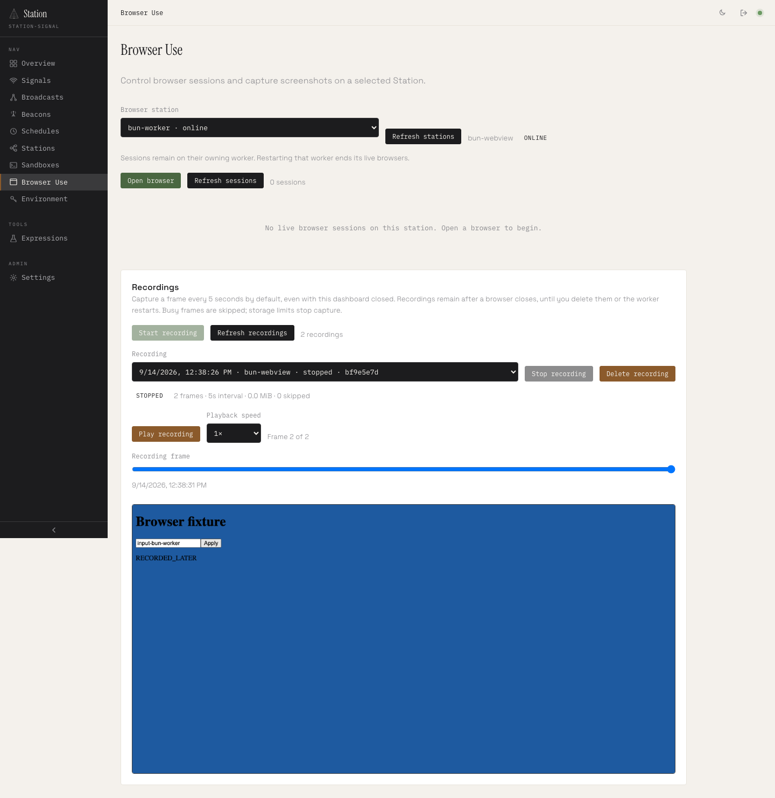

# Browser Use screenshot recording

September 14, 2026 · Station 2.4.0 development branch

Browser Use now supports optional five-second screenshot recording with dashboard playback. Capture runs on the owning worker, so it continues when the dashboard is closed or displaying another page. Both Bun WebView and Playwright use the same recording API.

## Use it

1. Open **Browser Use**, select a worker and open a browser.
2. Navigate to the page, then select **Start recording**.
3. Continue using the browser. The worker attempts an immediate capture and then a capture every five seconds.
4. Stop recording or close the browser. Select the retained recording to play, pause, scrub or change playback speed.
5. Delete the recording when its frames are no longer needed.

Playback uses frame timestamps, including gaps between captures. Busy sessions skip capture ticks instead of queueing work. This is a sequence of viewport screenshots, not continuous video or a complete action audit.

## Retention

Defaults are 120 frames per recording, 16 retained recordings and 64 MiB of PNG bytes across a manager. A frame or byte limit stops recording and preserves existing frames. New recordings at the count limit are rejected until space is freed. Operators can configure these bounds and the interval in the manager's third constructor argument.

Frames remain available after the live browser closes, but are stored in worker memory. Worker restart loses recordings; no durable video/archive storage is implied. Stop/delete/close/shutdown clear capture timers and settle in-flight screenshots.

All recording controls and frame reads use the existing admin-only Headquarters gateway and exact worker ownership. Listing metadata does not transfer PNG payloads; the player requests one frame at a time. Draining permits recording reads, stopping and deletion while rejecting new recordings.

## Verification

- Nineteen Browser Use unit tests passed on Node, including nine recording tests for cadence, busy skips, resource bounds, defensive copies, failures and lifecycle races.
- The nine recording tests also passed on Bun 1.3.14.
- Eight execution gateway tests passed, including private-worker authentication, administrator authorization, input validation, retained frames and draining cleanup.
- The production dashboard E2E passed with both SQLite and PostgreSQL 16 registries and real, separate Headquarters and Bun/Playwright workers: recording continued while the UI was on another page, frames changed after a page update, the measured capture gap matched the five-second default, stop and browser close stopped recording, and retained frames played/scrubbed correctly before deletion. No dashboard JavaScript errors occurred.

The complete `pnpm release --dry-run --allow-dirty` also passed: build, typecheck, site/LLM generation, 332 TAP passes (two existing platform skips), 26/26 browser-hosted Station checks, all 16 package archives and their publish dry runs. Nothing was uploaded.

These recording checks ran on macOS ARM64. The existing Linux primitive validation predates recording; the Linux harness now includes the recording unit suite for subsequent runs.

Reproduce with `pnpm test:execution:dashboard`. Optional `STATION_E2E_DATABASE_URL` selects a scratch PostgreSQL registry. See [the E2E guide](../packages/station-kit/test/e2e/README.md) and [the package API](../packages/station-browser-use/README.md).

## Playback after closing the browser

[SQLite test summary](./artifacts/browser-recording/sqlite-summary.json) · [PostgreSQL test summary](./artifacts/browser-recording/postgres-summary.json) · [Playwright playback screenshot](./artifacts/browser-recording/playwright-worker-recording-playback.png)
