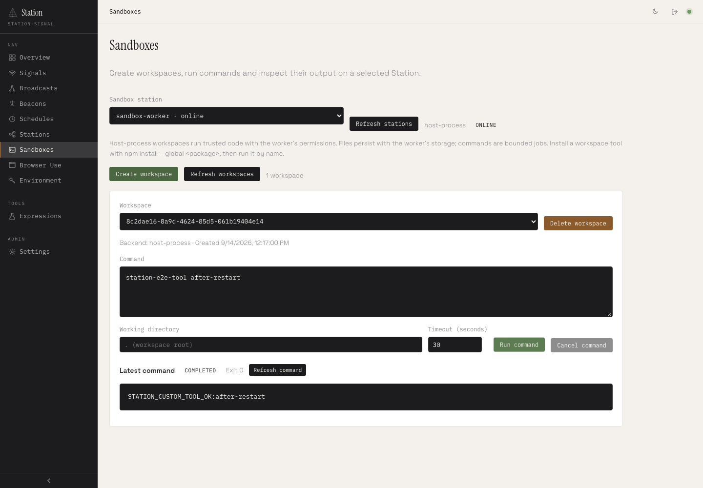
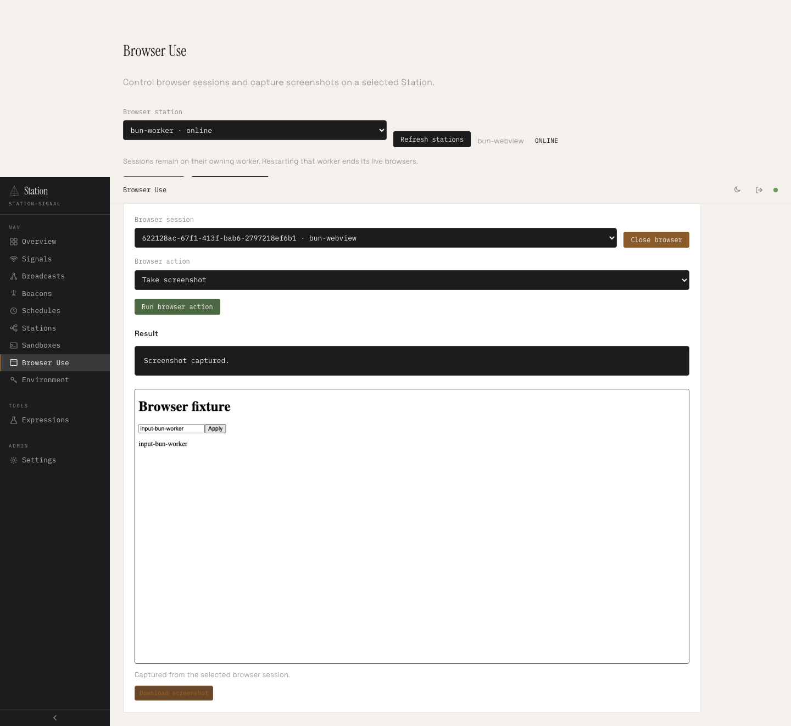
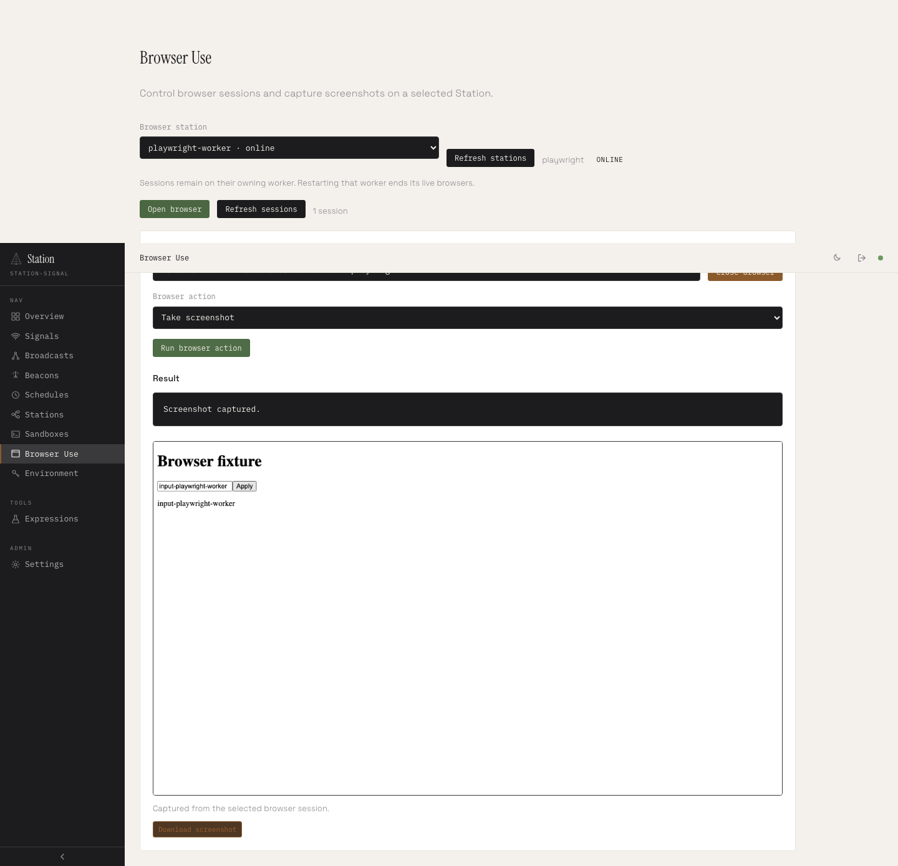

# Station execution dashboard and end-to-end validation

September 14, 2026 · prepared release 2.4.0

Follow-up: [Browser Use recording and playback](./station-browser-recording.md) adds five-second screenshots and retained-session playback.

StationKit now exposes **Sandboxes** and **Browser Use** as separate dashboard pages. Administrators can select a capable worker and manage its resources through Headquarters. A real custom CLI installation was verified through the dashboard, including a fresh command and a complete restart of the owning worker.

## What changed

- **Sandboxes:** discover workers, create/select/delete workspaces, run commands, choose a timeout, inspect stdout/stderr and exit status, and cancel running commands.
- **Browser Use:** discover workers and their backend, open/select/close sessions, navigate, click, type, press keys, evaluate JavaScript, and display/download PNG screenshots. Closing also interrupts a pending browser action.
- **Discovery:** workers advertise their configured execution adapters. The admin-only catalog scopes results to the network, checks leases, and exposes availability without exposing private endpoint credentials.
- **Custom tools:** each sandbox prepends its local `node_modules/.bin` and `HOME/.local/bin` to PATH. The default npm global prefix is its persistent home. A normal `npm install --global <package>` makes its executables available by name to later commands in that workspace.
- **Documentation:** the site, agent skill, package documentation and network example describe the dashboard and installation behavior.

## Actual end-to-end topology

The harness launches the production Next.js dashboard, Headquarters, a Sandbox worker, a Bun Browser Use worker and a Playwright Browser Use worker as separate OS processes. Playwright logs in through the real form and drives the public dashboard; Headquarters routes operations to the private owner. The complete scenario passed with both SQLite and a fresh PostgreSQL 16 registry.

### Custom installation and sandbox lifecycle

The test packs a small dependency-free CLI fixture with real `npm pack`, then installs that tarball through the dashboard using real npm in offline mode. A new command invokes `station-e2e-tool` directly. A second workspace cannot discover that executable through its PATH. After stopping and restarting the entire sandbox worker on the same persistent directory, the original workspace can still invoke the CLI.

The scenario also verifies stderr and exit code 7 from a failed command, cancellation, a one-second timeout, and workspace deletion removing its files and installed tool. It does not assume an in-memory mock stands in for shell execution or package installation.

### Browser lifecycle

Both browser adapters pass navigation, clicking, typing, Backspace, JavaScript evaluation, screenshot rendering and PNG download checks. Closing a session during an evaluation that never resolves terminates that session and settles the pending request. No dashboard JavaScript errors were recorded.

## Verification

| Check | Result |
| --- | --- |
| Production dashboard + separate workers, SQLite | Passed |
| Same complete dashboard scenario, PostgreSQL 16 | Passed |
| Custom npm install, fresh command and owner process restart | Passed on both database configurations |
| Bun WebView and Playwright dashboard actions and PNG downloads | Passed on both database configurations |
| Workspace regression suites | 322 TAP passes; two existing Linux `/proc` checks skipped on macOS |
| Existing browser-hosted Station example | 26/26 checks passed |
| Debian ARM64 primitive suites | 23/23 on Node and 23/23 on Bun; no skips |
| Real Linux Chromium browser checks | 2/2: Bun WebView and Playwright |
| Release dry run | Build, typecheck, documentation generation, tests, 16 archives and 16 npm publish dry runs passed |

Native validation used macOS ARM64, Node 22.18.0 and Bun 1.3.14. SQLite and PostgreSQL results are preserved in [SQLite summary](./artifacts/execution-dashboard/sqlite-summary.json) and [PostgreSQL summary](./artifacts/execution-dashboard/postgres-summary.json).

Linux validation used fresh Debian Bookworm dependencies, Node 22.23.2, Bun 1.3.14 and Chromium 152.0.7977.82. The container ran as a nonroot user with no host runtime socket, two CPUs, a 3 GiB memory cap and runtime networking disabled except loopback. The custom install and restart tests also passed there. The trusted browser fixture disables Chromium's own sandbox; this is functional validation, not a tenant-isolation result. The complete Headquarters dashboard topology was tested on macOS, not inside this Linux container. See the [Linux test output](./artifacts/execution-dashboard/linux-tests.txt).

## Review screenshots

Sandbox with the installed CLI still working after its owner restarts:



Bun browser session and captured screenshot:



Playwright browser session and captured screenshot:



## Reproduce

```sh
pnpm test:execution:dashboard

# Optional: use a test PostgreSQL database for the registry.
STATION_E2E_DATABASE_URL=postgresql://... pnpm test:execution:dashboard

# Fresh Linux dependencies and real Chromium; requires a running engine.
CONTAINER_ENGINE=podman scripts/execution-linux/run.sh

# Full release preflight without uploading packages.
pnpm release --dry-run --allow-dirty
```

The dashboard harness requires Bun and installed Playwright Chromium. See [its README](../packages/station-kit/test/e2e/README.md) for prerequisites and artifact options. PostgreSQL tables use a random test prefix and are removed during cleanup.

## Boundaries

The host sandbox executes trusted code with the worker OS user's permissions. Separate workspaces and PATH settings are not tenant isolation. Shared system dependencies belong in the worker image; the custom-install test establishes a real npm CLI workflow, not compatibility with every installer or native package.

Workspace files survive worker replacement only when the same persistent storage is retained. Live commands and browser sessions do not survive replacement. Browser state remains ephemeral. The dashboard uses existing administrator authorization, not a new per-tenant access model.

No Railway deployment, production load benchmark or hostile-code isolation assessment was performed. Nothing was published to npm. The temporary PostgreSQL database and Linux test VM were removed after testing.
