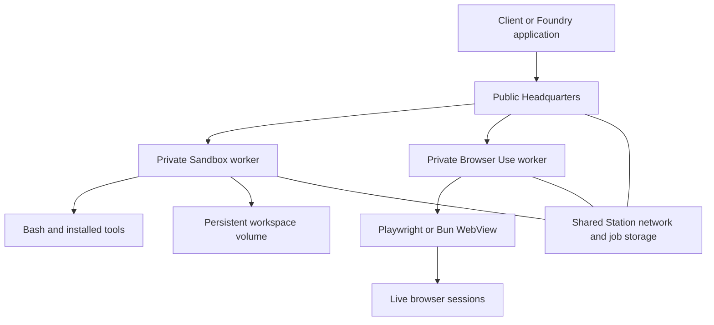

# Station execution: implementation and review

Prepared September 14, 2026. Release version: **2.4.0**.

Follow-up: [Dashboard and end-to-end validation](./station-dashboard-validation.md) records the added Sandbox/Browser Use dashboard pages, persistent custom tool installation, and newer verification results. The counts below describe the original implementation checkpoint.

The first execution release is implemented: **Station Sandbox**, **Station Browser Use**, authenticated Headquarters routing, and optional Bun execution for signals and beacons. The complete release dry run passed for all sixteen packages. No npm packages were uploaded and no cloud resources were provisioned.

This is a working foundation for trusted agent workloads. The larger Foundry deployment platform still needs automatic placement, durable workflow/session coordination, stronger tenant isolation and deployment automation.

## What you can use now

| Capability | Implemented behavior |
| --- | --- |
| Station Sandbox | Persistent workspace and home directories, real Bash commands, output/status polling, cancellation, timeouts and cleanup. |
| Shared tools | Install Bash, Node, Git and other programs once in the worker image; workspaces use the worker's configured PATH. |
| Station Browser Use | Independent browser sessions, navigation, click/type/key input, JavaScript evaluation and PNG screenshots. |
| Browser adapters | Playwright and Bun WebView. Each Bun session gets its own Bun subprocess and Chrome session. |
| Headquarters gateway | Admin-authenticated public RPC, separate private worker token, exact-owner routing and bounded requests/responses. |
| Specialized workers | A three-service example: Headquarters, a Sandbox worker and a Browser Use worker. |
| Bun process runtime | Opt-in Bun children for signals and beacons; Node remains the default controller/child choice. Broadcast signal steps use the configured signal runner. |
| Agent documentation | Site guide, navigation/cross-links, agent skill reference, and generated LLM documentation. |

`station-browser` remains the existing package for Station inside Web Workers and service workers. `station-browser-use` is the separate server browser automation primitive. Sandbox and Browser Use do not require each other.



## The execution contract

Send JSON POST requests to Headquarters:

```text
/api/v1/stations/:stationId/execution/sandbox
/api/v1/stations/:stationId/execution/browser
```

Keep the owner station ID alongside every returned workspace/session ID. Sandbox supports `create`, `list`, `get`, `destroy`, `exec`, `command` and `cancel`. Browser Use supports `open`, `list`, `action` and `close`.

Commands start asynchronously and are polled by their returned command ID. Browser actions operate on an existing live session. A worker becoming unavailable does not silently move or recreate either resource. Ambiguous transport failures are not automatically retried because the operation may already have taken effect.

The gateway verifies the registered owner's network membership and live lease. Draining prevents new work while allowing inspection and cleanup. It refuses redirects, keeps public credentials out of worker requests, sanitizes errors and caps request bodies at 128 KiB and proxied responses at 33 MiB.

The host Sandbox backend declares `isolated: false` and `pty: false`. Workspace folders organize trusted code; they do not confine that code. It inherits only its explicitly configured execution environment and basic tool-path/home settings, but commands retain the worker OS user's filesystem and network permissions.

## Bun: what was established

You can choose Bun without migrating the entire application:

```ts
import { defineConfig } from "station-kit";
import { BunProcessRuntime } from "station-signal";

export default defineConfig({
  processRuntime: new BunProcessRuntime("bun"),
});
```

The process runtime is independent of the browser adapter. The controller can stay on Node while signals/beacons use Bun and a browser worker uses either Playwright or Bun WebView. Custom process adapters return a Node-compatible child process with JSON IPC and lifecycle operations.

Tests cover real TypeScript execution, IPC output and injected environment values, failures, cancellation, beacon readiness/restarts and process cleanup. Missing executables, synchronous launcher failures, and both forms of IPC-send failure now settle work correctly. Failed initialization retains supervision until live beacon children have exited.

### Local measurements

Measured on macOS ARM64 with Node 22.18.0 and Bun 1.3.14. These are fresh-process timings through Station's actual bootstrap with an in-memory adapter and a trivial signal. Twenty samples per case, after three discarded warmups; case order alternated.

| Child configuration | Median completion | p95 | RSS sampled inside handler |
| --- | ---: | ---: | ---: |
| Node, compiled JavaScript | 134.4 ms | 148.7 ms | 54.6 MiB |
| Node + tsx, TypeScript | 235.2 ms | 314.1 ms | 88.7 MiB |
| Bun, JavaScript | 79.5 ms | 93.2 ms | 53.6 MiB |
| Bun, TypeScript | 80.3 ms | 106.6 ms | 53.5 MiB |

Bun took about one-third as long as Node + tsx in this startup-heavy TypeScript case. Against precompiled Node JavaScript, the advantage was about 1.7×, with similar sampled memory. Adding a 250 ms wait reduced the TypeScript advantage to about 1.55×: 534.9 ms versus 344.0 ms median, across ten samples.

This is evidence for cheaper process startup on this machine. It does not establish fleet throughput, peak/process-tree memory, Linux behavior, database performance, concurrent load, or browser/model-call speed. The harness ends timing at result IPC and reaps the child; natural process-drain time is excluded. Bun's shell also does not replace real Bash. Its built-in POSIX terminal API worked in a local smoke test, but a Station PTY API is a later feature.

Reproduce with `pnpm benchmark:runtimes`; set `STATION_BENCH_DELAY_MS=250` and `STATION_BENCH_SAMPLES=10` for the delayed case. Raw results are in [startup measurements](./benchmarks/runtime-startup-macos.json) and [delayed measurements](./benchmarks/runtime-delay-macos.json).

## Verification and release

- Complete `pnpm release --dry-run --allow-dirty` passed: build, typecheck, browser installation, tests, all sixteen archives and all sixteen npm publish dry runs.
- Workspace TAP suites: **318 passed**, zero failed; two existing Linux `/proc` tests skipped on macOS.
- Existing browser-hosted Station example: **26/26** real browser checks passed, including worker/service-worker recovery, signals, beacons and broadcasts.
- New Browser Use: **10 unit tests** and **two real browser integration tests against built JavaScript**, one each for Bun/Chrome and Playwright. These verify input, evaluation, PNG output, separate cookies and cancellation/cleanup.
- Station Sandbox: **11 real-process tests passed on Node and separately on Bun**. Coverage includes filesystem persistence, restart interruption, timeouts, cancellation escalation, descendants holding pipes open, UTF-8 output bounds and persistence failures.
- StationKit: **83/83 tests passed**, including authentication, exact-owner routing, draining cleanup, response limits, redirect refusal and shutdown with pending browser work.
- Site build passed and generated the LLM index, full text and **31 Markdown documentation pages**.

Version 2.3.0 was already published, so all public packages were advanced together to 2.4.0. The release order now includes both primitives before StationKit. The normal release command remains `pnpm release`; it requires a clean checkout and npm authentication. A live release publishes packages, so only its dry-run path was executed here.

## Deployment boundaries and next work

The new primitives declare Node 20 or newer; validation used Node 22. Bun and a Chromium installation are additionally required when selecting Bun browser sessions. Bun WebView is experimental. At this initial checkpoint, Linux/Railway, native WebKit, Windows and production fleet performance had not been validated. The follow-up report above records subsequent Linux primitive and PostgreSQL dashboard verification; Railway remains unvalidated.

The example provides configurations and deployment instructions for ordinary services. Its Postgres deployment has not been provisioned or exercised against a live cloud database here. Headquarters should be the only public service; specialized workers need private endpoints and their own tooling. Persist workspace files and Station data on volumes, and disable sleeping when live sessions must remain available.

Use one process per stable worker identity and workspace root. Files and saved command records can survive replacement; live shells, processes, browser tabs and memory cannot. A service supervisor must reap processes from a crashed manager. Application concurrency/output/time limits are not hard OS CPU, memory or disk quotas.

The next platform stages remain explicit:

1. Automatic environment placement, capacity reservation and a durable owner directory.
2. PTYs, reconnectable output streams and interactive input/resize.
3. Container/VM/provider adapters with declared isolation capabilities and per-tenant authorization.
4. Workflow/session leases, fencing, idempotency, draining and recovery across workers.
5. Browser profiles, artifact transfer, multiple pages and idle expiry.
6. Foundry build/image/registry deployment flow, secrets, observability, quotas and fleet operations.

## Review entry points

- [Implementation plan](./station-sandbox.md)
- [Three-service example](../examples/18-execution-network/README.md)
- [Sandbox package](../packages/station-sandbox/README.md)
- [Browser Use package](../packages/station-browser-use/README.md)
- [Agent reference](../.claude/skills/station/execution.md)
- [Site guide source](../docs/src/app/docs/execution/page.tsx)
- [Benchmark harness](../scripts/benchmark-runtimes.mjs)

Background references: [Bun WebView](https://bun.com/docs/runtime/webview), [WebView API](https://bun.com/reference/bun/WebView), [Bun subprocesses](https://bun.com/docs/runtime/child-process), [Node compatibility](https://bun.com/docs/runtime/nodejs-compat), [Railway private networking](https://docs.railway.com/networking/private-networking) and [Railway volumes](https://docs.railway.com/volumes).
