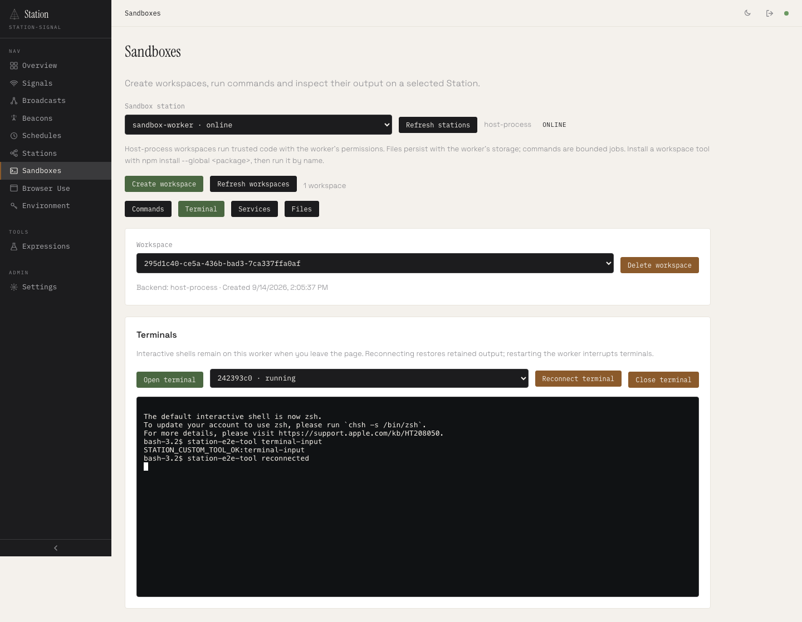
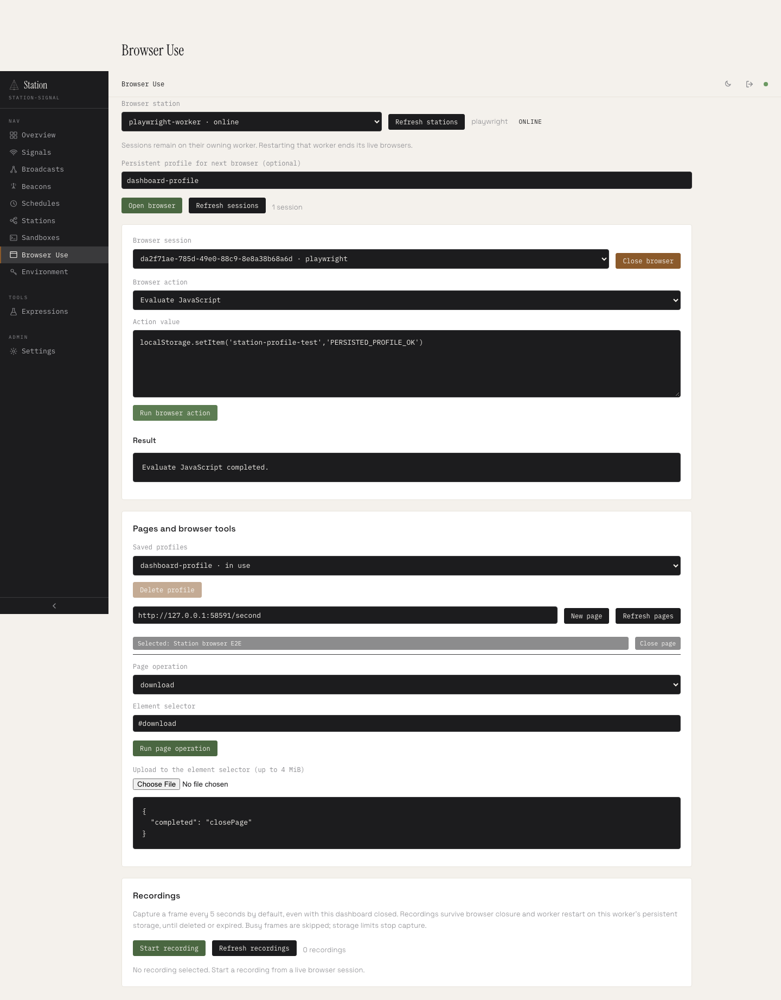
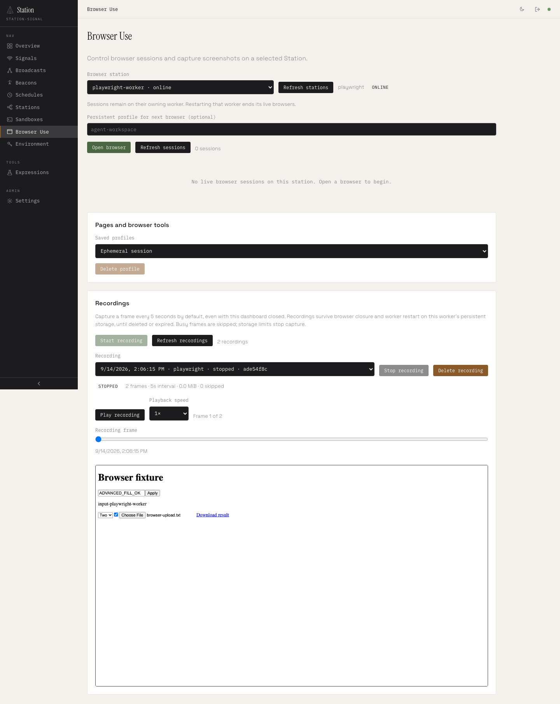

# Station execution environments — production review

This report records the earlier production baseline. See [Browser Use completion review](browser-use-completion.md) for the subsequent browser capabilities, validation and remaining deployment limits.

The implementation now includes public tenant execution boundaries alongside the operator dashboard. Sandbox and Browser Use remain separate primitives with separate adapters and lifecycles. The public architecture uses one dedicated private worker per tenant, not customer code inside the Headquarters process.

## What is implemented

| Area | Delivered behavior |
| --- | --- |
| Sandbox | Persistent workspace/home, custom npm tools, bounded commands, file upload/download, interactive Node PTYs with input/resize/reconnect, supervised long-lived services with explicit restart policy and history. |
| Container Sandbox | Docker/Podman adapter; one nonroot container and named volume per workspace; read-only root, dropped capabilities, no-new-privileges, CPU/memory/PID limits, restricted networking and owner-checked recovery. No host fallback. |
| Browser Use | Basic Bun and Playwright sessions; Playwright profiles, multiple pages, form controls, waiting/navigation/content, uploads/downloads, idle expiry and bounded audit metadata. |
| Container Browser | One isolated Playwright container per session; immutable image worker; constrained resources; exclusive profile volumes; bounded JSON transport; no daemon payload logging. |
| Trace playback | Screenshots every five seconds without the dashboard open; play/pause/scrub; optional disk-backed PNG/metadata recovery and TTL. Recovered recordings are stopped, not resurrected browsers. |
| Customer access | Execution-only API keys mapped to tenants, dedicated workers, checks at Headquarters and worker, immutable tenant bindings before recovery, cross-tenant404s, rate/concurrency admission shared across a tenant's keys. |
| Operator UI | Sandbox commands/terminals/services/files, browser sessions/profiles/pages/artifacts/recordings, capability-aware controls and customer execution-key creation. |
| Developer contract | Site guide, agent skill/reference, generated LLM documentation, image build and tenant deployment contract. |

Host backends remain available for trusted local/operator workloads. Tenant workers refuse host or unrestricted-network backends. Native PTYs currently require a Node controller; Bun can still run as a child inside a sandbox. Bun browser capabilities remain explicitly narrower than Playwright.

## Verification

The final release dry run passed for all 16 public packages: 358 TAP tests passed, two existing tests skipped, and 26/26 browser-runtime checks passed. All builds, typechecks, archive validations and npm publish dry runs completed without uploading anything.

Additional integration checks passed:

| Run | Result |
| --- | --- |
| Real two-tenant Headquarters/container topology | Passed on the final image; custom offline CLI, files, screenshots, cross-tenant/global API denial, capacity, revocation and storage reassignment checks. |
| Docker/Podman adapter against actual Podman Linux engine | 3/3, including crashes, kernel limits, helper PATH protection, multibyte terminals and file error mapping. |
| Container Browser against final image | 1/1 scenario covering separate sessions, profile recovery, page controls, transfers, recording recovery and pending-action cancellation. |
| SQLite dashboard | Passed; all advanced Sandbox/browser controls and recovery, zero JavaScript errors. |
| PostgreSQL17 dashboard | Passed in 54.8 seconds, including customer execution-key provisioning/revocation; zero JavaScript errors. |
| Fresh Debian ARM64 toolchain | 49 Node tests and 49 Bun tests passed, one explicit unsupported Bun PTY skip, two real browser smokes and one advanced Playwright integration passed. |

The Linux toolchain was Node 22.23.2, Bun 1.3.14 and distro Chromium 152.0.7977.82. The isolated browser image used pinned Playwright 1.63.0 with bundled Chromium 153.0.8010.12. These are observed test environments, not a universal compatibility claim. Test-only containers/database credentials were cleaned up.

[Dashboard evidence](artifacts/production-dashboard/summary.json) includes the exact completed scenarios and reviewed screenshots at desktop and 390px widths. The reproducible test commands are:

- `pnpm test:execution:dashboard`: real Headquarters/private workers, custom offline CLI, terminals, files, HTTP services, browser tools, worker replacement and durable recording playback.
- `pnpm test:execution:tenants`: real isolated Linux containers behind Headquarters, two tenant identities, custom installation, cross-tenant denial, browser screenshot, capacity, revocation and retained-storage reassignment protection.
- `pnpm test:execution:containers`: kernel/runtime flags, custom install persistence, services/PTYs, crashes, network-policy checks and sanitized file failures.
- `pnpm test:browser-use:containers`: separate browser containers, cookies/profiles, page controls, transfers, screenshot/recording recovery and cancellation.
- Fresh Linux harness: distro toolchain and Node/Bun compatibility, native PTYs, browser primitives and persistence.
- `pnpm release:dry-run --allow-dirty`: every package build, typecheck, unit suite, archive validation and npm publish dry run. No upload.

Testing found and fixed a macOS service process-group exit race, dashboard file EOF/chunk handling, container helper PATH substitution, missing-file error mapping, container tmpfs incompatibility, and tenant ownership checks that originally happened after recovery could touch retained data.

## Public rollout requirements

The tested safe network policy is `none`. This runs offline tools and bundled/loopback applications. Internet-capable customer browsing needs an externally enforced named egress network; `networkRestricted: true` is an operator assertion, not a firewall installer. Protect metadata/private ranges, redirects/DNS rebinding and cross-tenant routes below workload-controlled processes.

Apply hard storage quotas to workspace/profile volumes and recording disks. Application output/upload/frame limits are not disk quotas. Patch and monitor the kernel, engine and image. Containers share a kernel; this implementation is not a separate-kernel VM boundary or an independent security certification.

Keep operator routes, private workers and engine APIs inaccessible to customers. Configure TLS, production key/database storage, ingress limits, backups and capacity budgets. Local root locks and request buckets do not provide distributed fencing, failover or multi-replica quotas. Service ingress/custom domains, automated provisioning, customer UI, metering and billing belong to the hosting platform around these primitives.

These operational requirements are necessary for a public deployment. No cloud service was provisioned and no npm package was published by this work.

## Review entry points

- [Tenant deployment and image contract](../scripts/execution-container/README.md)
- [Sandbox API](../packages/station-sandbox/README.md) and [container adapter](../packages/station-sandbox/CONTAINER.md)
- [Browser Use API](../packages/station-browser-use/README.md)
- [Agent execution reference](../.claude/skills/station/execution.md)

## Dashboard examples

