# Station Mesh: Multi-Station Scaling Plan

## Executive Summary

Station today is a single-station system: one HTTP server, one signal runner, one broadcast runner, one shared adapter. To scale we need stations that talk to other stations. This plan introduces a **Station Mesh** layer with three composable modes:

- **Federation** — a parent station forwards work to per-workspace child stations and load-balances across them.
- **Router** — a station with no local runner that routes triggers to a dynamic, updatable list of remote stations.
- **Orchestrator** — a station that proactively spawns and decommissions other stations (subprocess / Compose / Kubernetes).

All three share a foundation: workspaces, atomic work claim, an inter-station HTTP protocol, station identity, and a registry. Build the foundation once; each mode is then a thin layer.

---

## Table of Contents

1. [Current vs Target Architecture](#1-current-vs-target-architecture)
2. [Phase 0 — Foundations](#2-phase-0--foundations)
3. [Phase 1 — Federation Mode](#3-phase-1--federation-mode)
4. [Phase 2 — Router Mode](#4-phase-2--router-mode)
5. [Phase 3 — Orchestrator Mode](#5-phase-3--orchestrator-mode)
6. [Decisions Required](#6-decisions-required)
7. [PR Order](#7-pr-order)

---

## 1. Current vs Target Architecture

### 1.1 Today: single-station

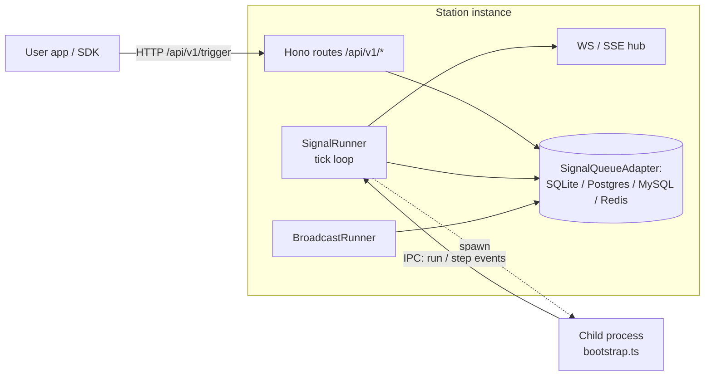

Everything runs in one process: HTTP, WS, both runners, child-process dispatch. Scaling is vertical only. Two runners against a shared DB race because the claim sequence isn't atomic.

### 1.2 Target: Station Mesh

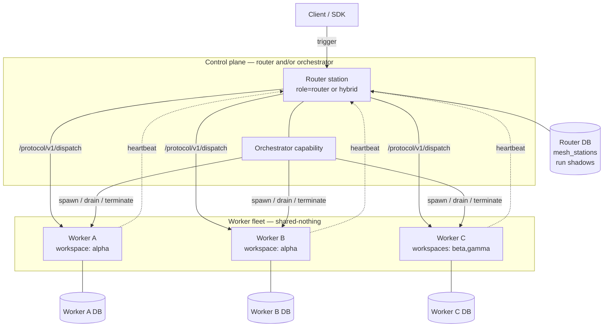

Control-plane tier (router + orchestrator capabilities, optionally combined) routes work to a worker fleet. Each worker owns its own adapter (shared-nothing). The control plane keeps a station registry and "shadow" run records mirroring their remote counterparts.

---

## 2. Phase 0 — Foundations

### 2.1 Workspaces (multi-tenancy)

No workspace concept exists today (`packages/station-signal/src/types.ts:7-24`). Every mode below needs scoping, so this lands first.

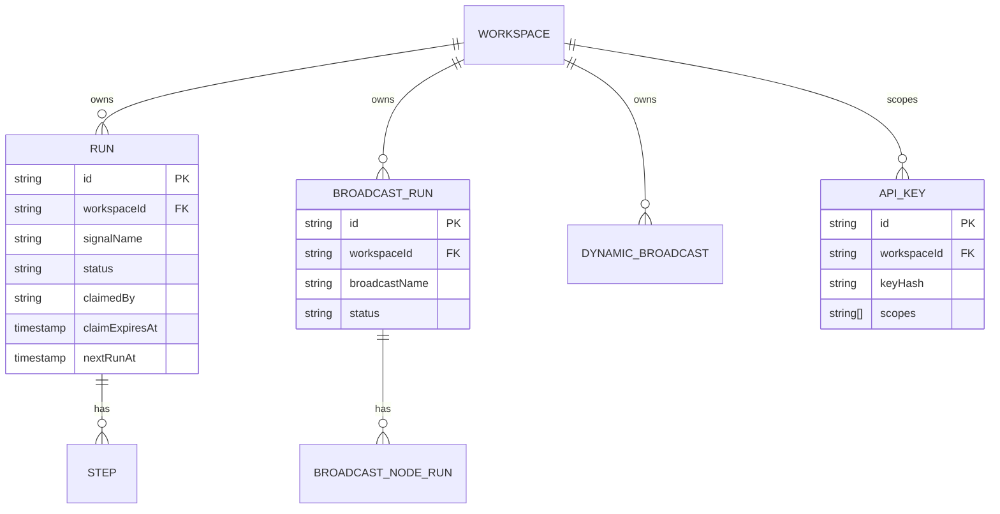

Changes:
- Add `workspaceId: string` to `Run`, `Step`, `BroadcastRun`, `BroadcastNodeRun`, `DynamicBroadcastSpec`.
- `SignalQueueAdapter` (`packages/station-signal/src/adapters/index.ts:3-29`) gains workspace filtering on every method.
- All five adapters (sqlite, postgres, mysql, redis, memory) migrate.
- `ApiKey` (`packages/station-kit/src/server/auth/keys.ts:16-26`) is scoped to a workspace; HTTP middleware enforces this on `/api/v1/*` routes.
- Backfill `"default"` on existing rows; ship a `station migrate workspaces` CLI command in `station-kit`.

### 2.2 Atomic claim — fix the multi-runner race

Today's `getRunsDue()` + `updateRun(status='running')` is two separate statements (Postgres adapter at `packages/station-adapter-postgres/src/index.ts:185-195`). With two runners against the same DB, both can read the same pending run and both spawn it.

**Today (race):**

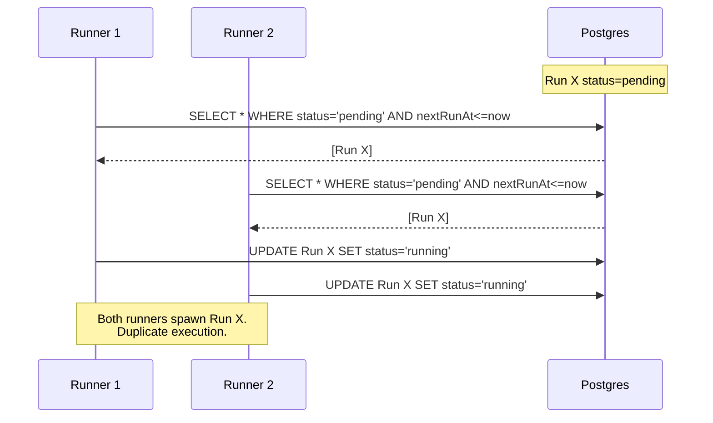

**With atomic claim:**

```mermaid
sequenceDiagram
    participant R1 as Runner 1
    participant R2 as Runner 2
    participant DB as Postgres
    Note over DB: Run X status=pending

    R1->>DB: BEGIN;<br/>SELECT ... FOR UPDATE SKIP LOCKED LIMIT N;<br/>UPDATE SET status='running', claimed_by=R1,<br/>claim_expires_at=now()+lease;<br/>COMMIT;
    DB-->>R1: [Run X]
    R2->>DB: BEGIN;<br/>SELECT ... FOR UPDATE SKIP LOCKED LIMIT N;<br/>(Run X already locked, skipped)<br/>COMMIT;
    DB-->>R2: []
    R1->>R1: spawn child for Run X
    loop while child alive
        R1->>DB: heartbeat: extend claim_expires_at
    end
    Note over DB: If R1 dies, lease expires;<br/>another runner re-claims on next tick.
```

Changes:
- New adapter method `claimRunsDue(limit, runnerId): Promise<Run[]>` replaces the read-then-write pattern.
- Postgres / MySQL 8: `FOR UPDATE SKIP LOCKED` + atomic update in one tx.
- Redis: Lua script combining `ZRANGEBYSCORE` + `ZREM` + hash `HSET` atomically.
- SQLite: `BEGIN IMMEDIATE` (single-writer; no SKIP LOCKED needed).
- `Run` gains `claimedBy` + `claimExpiresAt`. The runner heartbeats while the child lives (extending `claimExpiresAt`); on runner death the lease expires and another runner re-claims. See dispatch flow at `packages/station-signal/src/signal-runner.ts:610-637`.

This change is independently valuable: it unblocks safe multi-runner against a single shared DB even without any of the mesh layers.

### 2.3 Station Protocol — inter-station RPC

A versioned HTTP surface at `/protocol/v1/*`, separate from the user-facing `/api/v1/*`. Reuses the existing `KeyStore` with a new `mesh` scope.

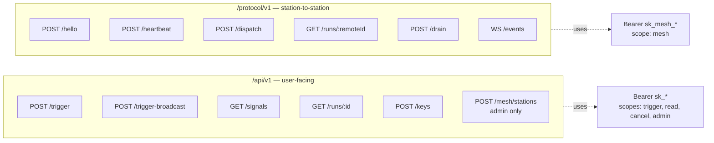

| Endpoint | Purpose |
|---|---|
| `POST /protocol/v1/hello` | Handshake; exchange `stationId`, version, role, capabilities |
| `POST /protocol/v1/heartbeat` | `{cpuLoad, activeRuns, maxConcurrent, queueDepth, workspaces}` |
| `POST /protocol/v1/dispatch` | Forward a trigger; `{workspaceId, signal, input, deadline, traceId}` → `{remoteRunId}` |
| `GET /protocol/v1/runs/:remoteRunId` | Status pull |
| `POST /protocol/v1/drain` | Graceful drain (orchestrator use) |
| `WS /protocol/v1/events` | Push lifecycle events back to parent |

Implementation lives at `packages/station-kit/src/server/routes/protocol/v1/*`, mirroring the existing `routes/v1/`.

### 2.4 Station identity & registry

- Each station has a stable `stationId` (UUID, persisted in the data dir like the keys file).
- Each station advertises a `baseUrl` over the protocol.
- A new optional `MeshAdapter` owns a `mesh_stations` table:

```ts
interface MeshStation {
  stationId: string;
  baseUrl: string;
  role: "worker" | "router" | "orchestrator" | "hybrid";
  capabilities: string[];
  workspaces: string[];
  capacity: {
    activeRuns: number;
    maxConcurrent: number;
    queueDepth: number;
    cpuLoad: number;
  };
  lastHeartbeat: string;
  status: "provisioning" | "ready" | "draining" | "drained" | "unhealthy";
}
```

Optional interface so non-mesh deployments aren't forced to migrate.

---

## 3. Phase 1 — Federation Mode

A station is a **parent** (knows its children) and/or a **child** (registered with a parent). Both roles use the protocol from Phase 0.3.

### 3.1 Registration & heartbeat

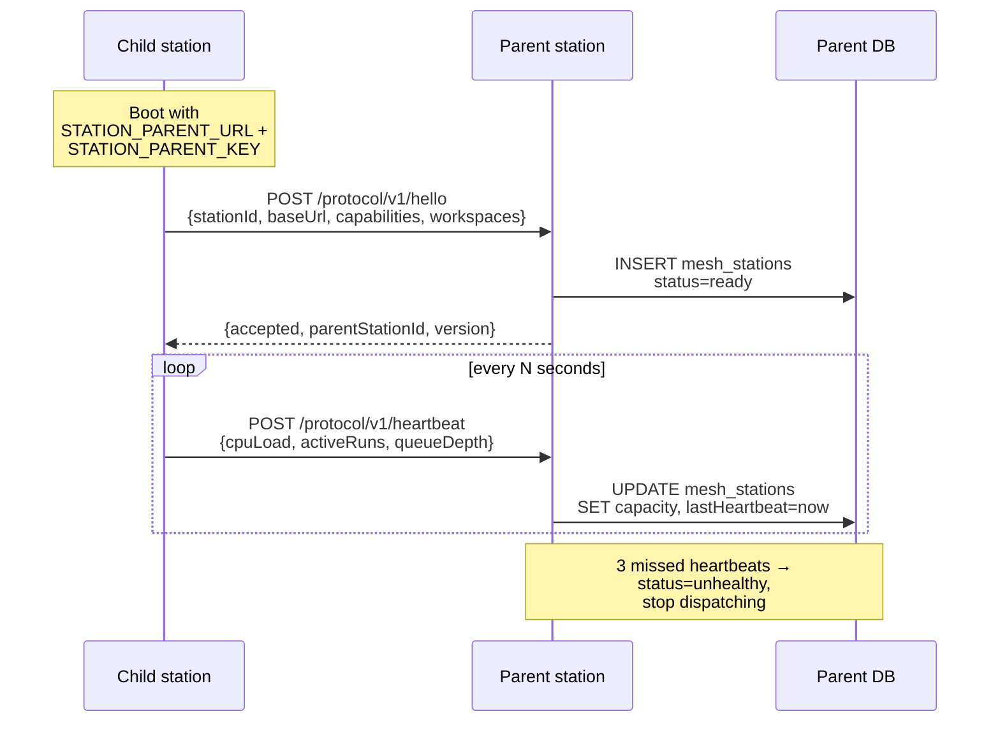

### 3.2 Trigger dispatch & status sync

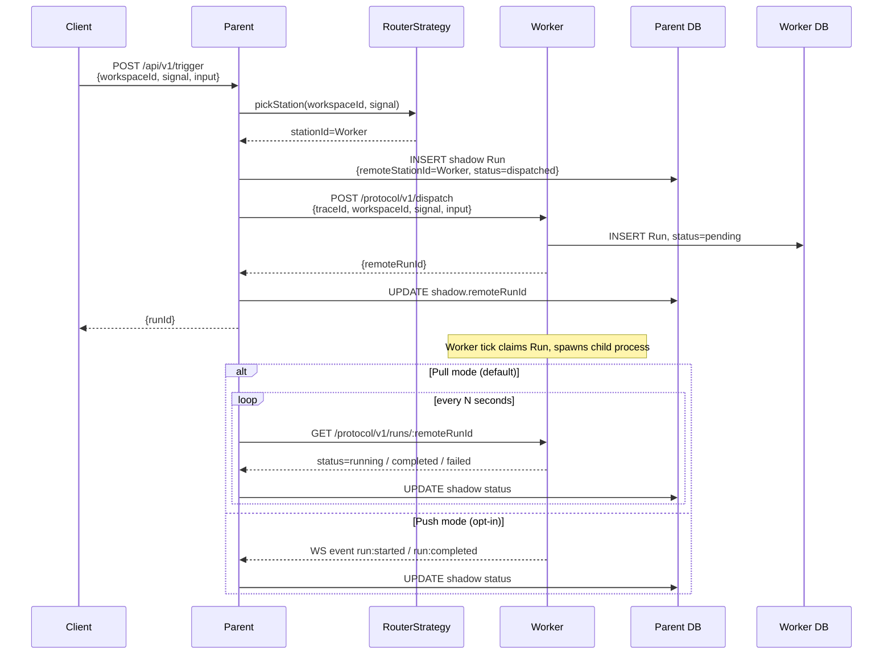

The parent's `/api/v1/trigger` (`packages/station-kit/src/server/routes/v1/trigger.ts:17`) consults a `RouterStrategy`, picks a child, and forwards via `/protocol/v1/dispatch`. The "shadow" Run gives the parent a local view for dashboards and queries.

### 3.3 Routing strategies

Per-workspace, configurable. New file: `packages/station-kit/src/server/mesh/router.ts`.

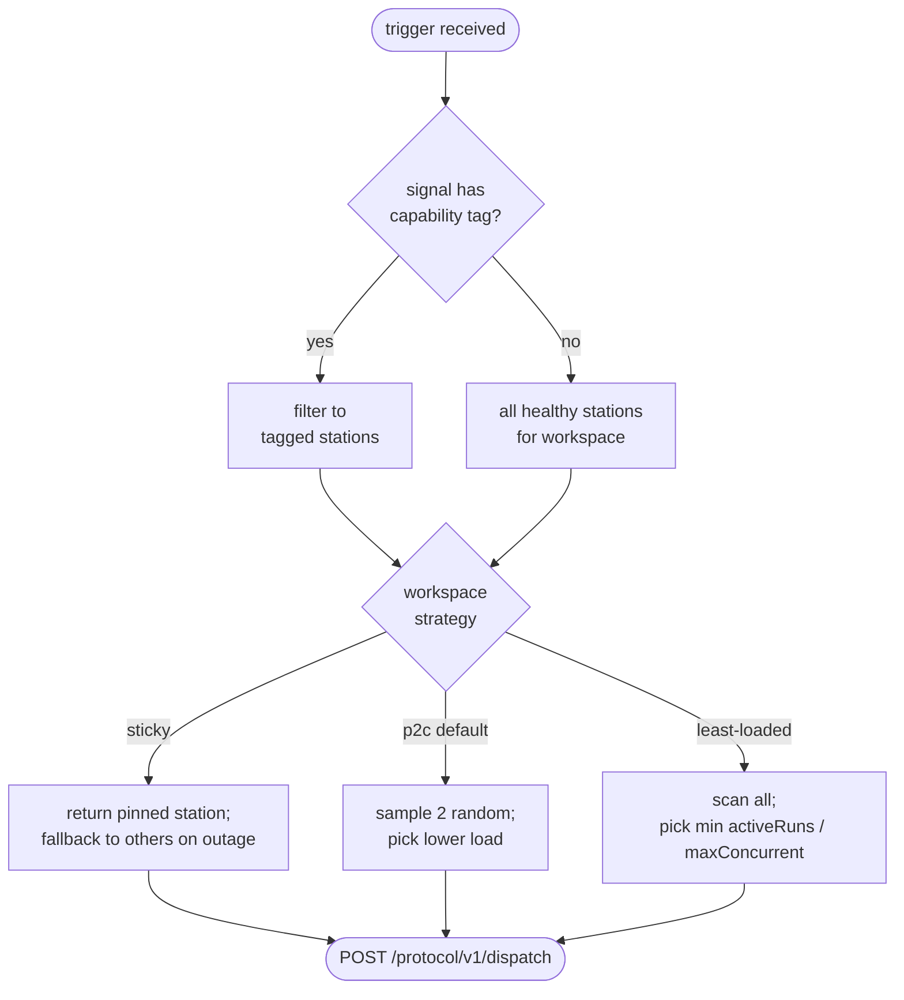

- **Sticky** — workspace pinned to one child. Simplest. Matches "workspace = own station".
- **Power of two choices** — sample two random healthy children, pick lower load. Default for non-sticky; avoids thundering-herd off stale capacity reports.
- **Least-loaded** — scan all, pick min `activeRuns / maxConcurrent`. Naive but fine at small scale.
- **Per-signal pinning** — signals tagged with required capabilities only dispatch to matching workers (specific runtime, GPU, mounted volumes).

---

## 4. Phase 2 — Router Mode

A station configured with `role: "router"` has no local `SignalRunner`. It exists purely to route. Builds on Phase 1 — same protocol, same registry, same strategies.

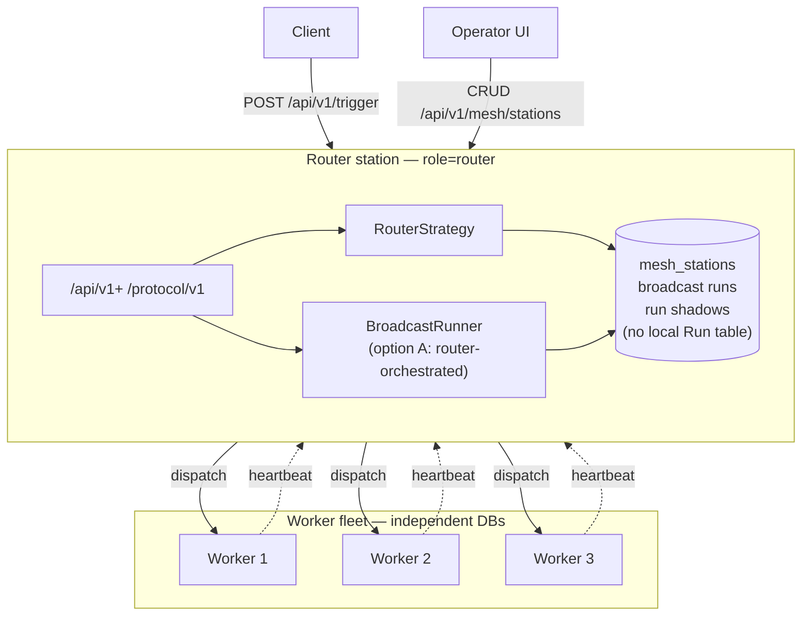

Changes:
- `StationUserConfig` (`packages/station-kit/src/config/schema.ts`) gains `role: "worker" | "router" | "hybrid"` and `mesh.defaults.stations: [{baseUrl, key}]` for seed remote instances.
- `createStation()` (`packages/station-kit/src/server/index.ts`) skips `SignalRunner` construction when `role === "router"`.
- New admin endpoints: `POST /api/v1/mesh/stations`, `GET ...`, `PATCH ...`, `DELETE ...` (admin scope).
- Dashboard gets an editable Routing page: list stations, edit weights, watch live capacity, drain/disable.

### 4.1 Broadcasts in router mode

Open question: who orchestrates a broadcast DAG when nodes run on different stations?

```mermaid
sequenceDiagram
    participant C as Client
    participant R as Router (BroadcastRunner)
    participant W1 as Worker 1
    participant W2 as Worker 2

    C->>R: POST /api/v1/trigger-broadcast<br/>{workspaceId, broadcast, input}
    R->>R: open BroadcastRun;<br/>compute root nodes = [A]
    R->>W1: dispatch node A
    W1-->>R: A completed (output o1)

    R->>R: A done; downstream ready: [B, C]
    par node B
        R->>W2: dispatch B with input from o1
        W2-->>R: B completed
    and node C
        R->>W1: dispatch C with input from o1
        W1-->>R: C completed
    end
    R->>R: BroadcastRun completed
    R-->>C: GET /runs/:id → status=completed
```

- **Option A (recommended)** — router owns `BroadcastRunner`, dispatches each node to a worker, tracks node statuses centrally. One pane of glass for the whole DAG. Router is stateful (can't be stateless behind a load balancer).
- **Option B** — workers orchestrate; on completion they call back to the router for next-hop dispatch. Stateless router, more HTTP hops, more protocol surface.

Recommend A for v1: matches the existing `BroadcastRunner` design and keeps the protocol smaller.

---

## 5. Phase 3 — Orchestrator Mode

By Phase 2 the protocol, registry, capacity model, and routing all exist. Orchestrator just adds lifecycle: spawn, drain, terminate.

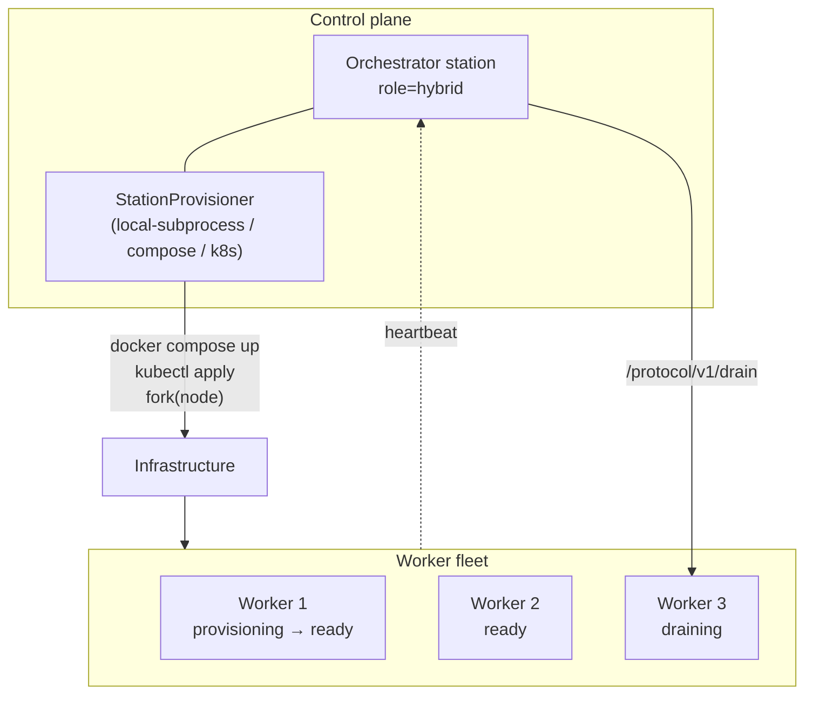

### 5.1 Provisioner abstraction

```ts
interface StationProvisioner {
  spawn(spec: StationSpec): Promise<StationHandle>;
  drain(stationId: string): Promise<void>;
  terminate(stationId: string): Promise<void>;
  list(): Promise<StationHandle[]>;
}
```

Implementations, in priority order:

1. **Local subprocess** — fork `node` directly. Simplest path to E2E tests.
2. **Docker Compose** — write an override fragment, `docker compose up -d <service>`. Matches "compose or something" from the original ask.
3. **Kubernetes** — Job / Deployment per station via `@kubernetes/client-node`.
4. **Fly / Railway / etc.** — community contributions.

### 5.2 Spawn lifecycle

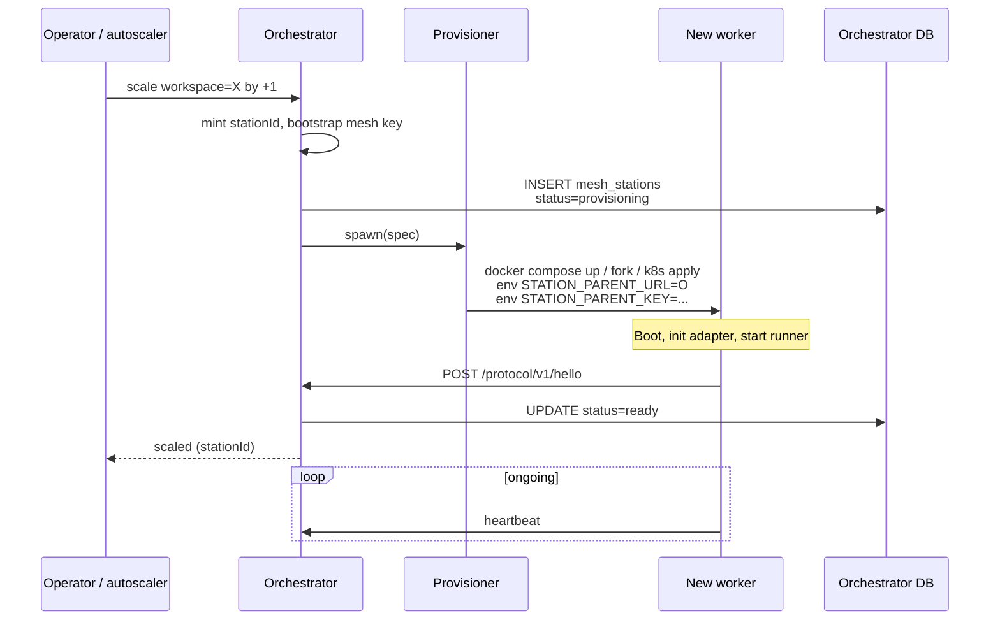

The orchestrator mints `stationId` + bootstrap mesh key, inserts a `provisioning` row, calls the provisioner, then waits for the child's `hello` to flip the row to `ready`.

### 5.3 Drain & terminate

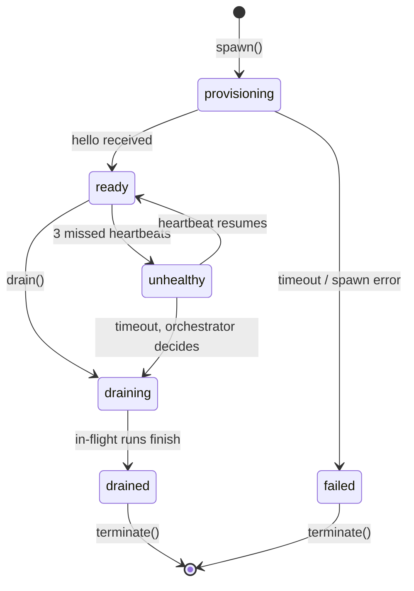

Drain stops new dispatch, in-flight runs complete, then the provisioner terminates the container/process.

### 5.4 Auto-scale triggers

- **Manual** (v1): "Add station for workspace X" button in the dashboard.
- **Capacity-based** (v2, off by default): if all children for a workspace are >80% utilization sustained for N minutes, spawn another. Autoscaling failure modes are nasty without conservative defaults; ship the manual path first.

---

## 6. Decisions Required

| # | Decision | Recommendation |
|---|---|---|
| 1 | Shared-nothing vs shared-DB children | **Shared-nothing** — each child has its own adapter / DB. Matches "its own station"; small blast radius. |
| 2 | Workspace ↔ station cardinality | **1:N** — one workspace can span many stations. Needed to scale a single busy workspace. |
| 3 | Status propagation: pull or push | **Pull first**, push (WS via existing hub at `packages/station-kit/src/server/ws.ts`) as opt-in optimization. |
| 4 | First provisioner | **Local subprocess + Compose** together; K8s in a follow-up. |
| 5 | Migration story for workspaces | Backfill `"default"` on existing rows + ship a `station migrate workspaces` CLI command in `station-kit`. |

---

## 7. PR Order

Each PR is independently shippable and revertable.

1. **Atomic claim** across adapters (Phase 0.2) — independently valuable; safe multi-runner against shared DB.
2. **Workspace scoping** + migration tool (Phase 0.1).
3. **Station protocol skeleton** + identity + registry (Phases 0.3 + 0.4).
4. **Federation: registration, heartbeat, dispatch** (Phase 1.1, 1.2).
5. **Routing strategies** + dashboard UI (Phase 1.3).
6. **Router-only mode** + admin endpoints + Routing page (Phase 2).
7. **Provisioner interface** + local-subprocess implementation (Phase 3 scaffold).
8. **Compose provisioner** + manual scale UI; auto-scale gated off (Phase 3).
